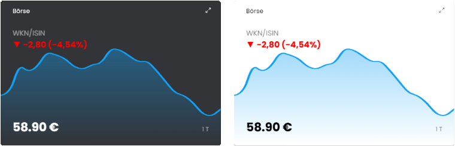

# 📉 Aktien-Widget (Stock Widget)

Dieses Modul dient zur Anzeige von Aktienkursen in der Kachelvisualisierung.  
Ideal für eine klare und kompakte Übersicht von Finanz- und Marktdaten auf Dashboards.

## Inhaltverzeichnis

1. [Funktionsumfang](#user-content-1-funktionsumfang)
2. [Voraussetzungen](#user-content-2-voraussetzungen)
3. [Installation](#user-content-3-installation)
4. [Einrichtung](#user-content-4-einrichtung)
5. [Statusvariablen](#user-content-5-statusvariablen)
6. [Darstellungen](#user-content-6-darstellungen)
7. [Visualisierung](#user-content-7-visualisierung)
8. [Befehlsreferenz](#user-content-8-befehlsreferenz)
9. [Versionshistorie](#user-content-9-versionshistorie)

### 1. Funktionsumfang

Durch die Nutzung des HTML-SDKs kann dieses Widget den Aktienkurs einer WKN oder ISIN anschaulich und übersichtlich darstellen. Neben der Kursentwicklung für einen wählbaren Zeitraum (1 Tag, 1 Woche, 1 Monat, 1 Quartal, 1 Halbjahr oder 1 Jahr) werden auch der aktuelle Trend – farblich hervorgehoben (positiv/negativ) – sowie der aktuelle Preis angezeigt.

### 2. Voraussetzungen

* Symcon ab Version 8.1

### 3. Installation

* Über den Modul Store das Modul _Aktien-Widget_ installieren.
* Alternativ über das Modul Control folgende URL hinzufügen.  
`https://github.com/Wilkware/StockWidget` oder `git://github.com/Wilkware/StockWidget.git`

### 4. Einrichtung

* Unter 'Instanz hinzufügen' ist das _Aktien-Widget_-Modul unter dem Hersteller '(Geräte)' aufgeführt.
Weitere Informationen zum Hinzufügen von Instanzen in der [Dokumentation der Instanzen](https://www.symcon.de/service/dokumentation/konzepte/instanzen/#Instanz_hinzufügen)

__Konfigurationsseite__:

_Einstellungsbereich:_

> 🚀 WKN/ISIN ...

Name                                | Beschreibung
------------------------------------|--------------------------------------------
Beschriftung                        | Überschrift/Label, z.B. WKN oder ISIN 
Schriftgröße                        | zu verwendende Schriftgröße in Pixel

> 💸 Trend ...

Name| Beschreibung
------------------------------------|--------------------------------------------
Variable                            | Tagesveränderung in folgendem Format +/- Preiswert (prozenturaler Veränderung), z.B. '+0,60 (+10%)'
Schriftgröße                        | zu verwendende Schriftgröße in Pixel
Farbe(Positiv)                      | Farbwert für positiven Trend
Farbe(Negativ)                      | Farbwert für negativen Trend

> 📈 Diagramm ...

Name                                | Beschreibung
------------------------------------|--------------------------------------------
Daten                               | Auswahl der zu verwendenden Daten für die Kurslinie
Farbe(Linie)                        | Farbwert für Liniendarstellung
Glatt zeichnen                      | Auswahl ob die Linie weich oder kantig (Direktverbindung Punkte) gezeichnet werden soll.
Füllung zeichnen                    | Darstellung einer nach unten auslaufenden farblichen Flächenfüllung (Gradient)
Unterer Versatz                     | Wieviel Prozent vom unteren Kachelrand soll die Liniendarstellung Abstand halten, kann zur besseren Lesbarkeit des aktuellen Preises genutzt werden.

__HINWEIS ZU DATEN DER KURSLINIE__: die Kennlinie (außer bei 1 Tag) nutzt den letzten geloggten Wert an den entsprechenden vergangenen Tagen. Der Zeitraum ist rollierend, d.h. 1 Woche entspricht den letzten 7 Tagen (inkl. heute), 1 Monat den letzten 30 Tagen usw. Wochenenden und Tage ohne Werte/Handel werden ignoriert bzw. nicht in die Darstellung mit einbezogen.
Bei 1 Tag werden die Daten des aktuellen Tages genutzt. Sollte an dem Tag kein Handel oder noch keine Daten eingelaufen sein, werden weiterhin die Tagesdaten des letzen Handelstages genommen, z.B. am Sonntag die Daten vom Freitag oder Dienstag früh vor 9 Uhr die Daten vom Montag.

> 💰 Preis ...

Name                               | Beschreibung
------------------------------------|--------------------------------------------
Variable                            | Geloggte Preisvariable des aktuellen Kurses (wird für Kennlinie genutzt)
Schriftgröße                        | zu verwendende Schriftgröße in Pixel

### 5. Statusvariablen

Es werden keine Statusvariablen angelegt.

### 6. Darstellungen

Es werden keine Darstellungen oder Profile benötigt.

### 7. Visualisierung

Das Modul kann direkt als Link in die TileVisu eingebunden werden.  
Die Kachel zeigt ...
- oben links die WKN/ISIN Beschriftung und den farblichen Tagestrend an
- unten links den aktuellen oder letzten Tageswert/-preis an
- unten rechts den ausgewählten Zeitraum (1T, 1W, 1M, 1Q, 1HJ, 1J) an
- die Kennlinie optimiert ihre Darstellung in Abhängigkeit von Platz und min/max Wert

### 8. Befehlsreferenz

Das Modul stellt keine direkten Funktionsaufrufe zur Verfügung.  

### 9. Versionshistorie

v1.1.20260930

* _NEU_: Versionsanzeige im Konfigurationsformular
* _NEU_: Zeiträume als rollierende Zeitspannen benannt (1 Tag, 1 Woche, ... 1 Jahr)
* _NEU_: Eigene Statusmeldungen (keine bzw. ungültige Preisvariable, Preisvariable wird nicht geloggt)
* _NEU_: Initialisierung erst nach vollständigem Systemstart
* _NEU_: Deutlich weniger Archivabfragen beim Aufbau der Kurslinie, Tageskurve auf max. 200 Punkte reduziert
* _NEU_: Namespaces für Bibliotheken eingeführt
* _FIX_: Zeitraum _1 Jahr_ führte zu einem Fehler
* _FIX_: Farbe für positiven Trend wurde nicht übernommen
* _FIX_: Kachel blieb ohne Trend-Variable leer
* _FIX_: Aktueller Tageswert der Kurslinie wird laufend aktualisiert, Wochenenden/Feiertage werden korrekt nachgetragen
* _FIX_: Darstellung bei keinem oder nur einem Datenpunkt
* _FIX_: Unterer Versatz von 0% wurde nicht übernommen
* _FIX_: Fehlende Übersetzung für Halbjahr (1 HJ)

v1.0.20250822

* _NEU_: Initialversion

## Danksagung

Ich möchte mich für die Unterstützung bei der Entwicklung dieses Moduls bedanken bei ...

* _Smudo_ : für die Vorarbeit bzw. Umstellung auf Tagesschau-Werten 👍
* _ralf_ : für die rege Hilfe im Börsenticker Channel 🙏

## Entwickler

Seit nunmehr über 10 Jahren fasziniert mich das Thema Haussteuerung. In den letzten Jahren betätige ich mich auch intensiv in der Symcon Community und steuere dort verschiedenste Skript und Module bei. Ihr findet mich dort unter dem Namen @pitti ;-)

## Spenden

Die Software ist für die nicht kommerzielle Nutzung kostenlos, über eine Spende bei Gefallen des Moduls würde ich mich freuen.

## Lizenz

Namensnennung - Nicht-kommerziell - Weitergabe unter gleichen Bedingungen 4.0 International

